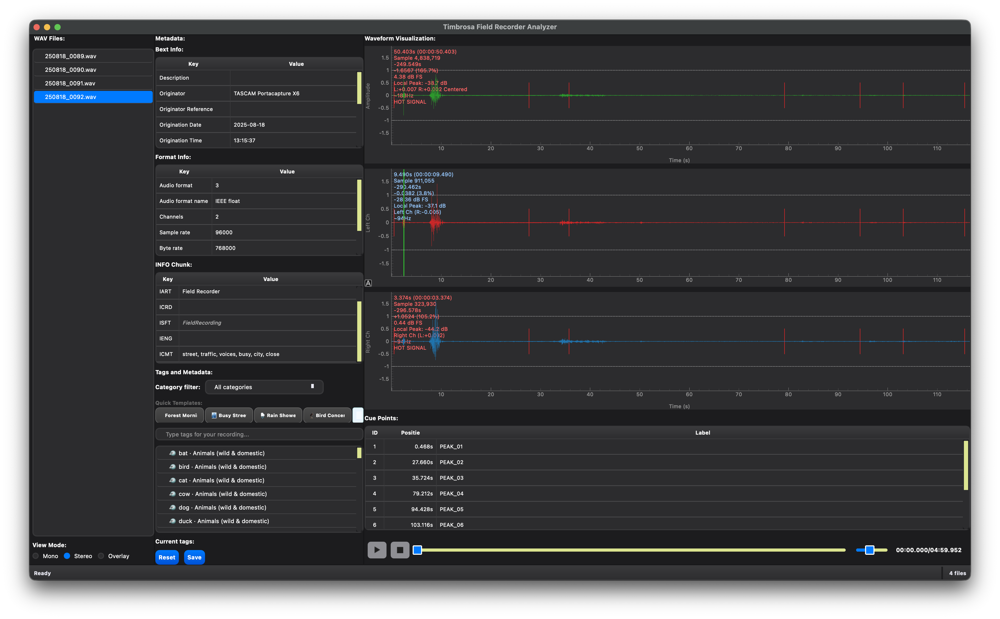

# TimbrosaField

TimbrosaField is a desktop application for analyzing, visualizing, and tagging field recordings. It stores metadata directly inside WAV files and can generate Ableton Live project templates organized by tag category — so you can browse your recordings by genre or subject without ever leaving Ableton.



---

## Features

### Audio analysis & visualization
- Waveform display with dynamic downsampling for smooth rendering of large files
- Mono and stereo support with per-channel views
- Clipping detection and cue point markers
- Built-in audio player with seek and volume controls

### Metadata & tagging
- Read and write INFO chunk and BEXT metadata directly in WAV files
- Custom tag system with auto-completion and template support
- Quick-apply tag templates via `Ctrl+1` – `Ctrl+4`
- Batch tag editor for applying tags to multiple files at once (`Ctrl+B`)

### Export & workflow
- **Ableton Live export** — generates a multitrack `.als` project with category-based tracks
- **CSV export** — full metadata table for all files in the active directory (`Ctrl+Shift+E`)
- **JSON tag backup** — export all tags as a portable JSON file
- **Analytics dashboard** — tag frequency, audio specs, and timeline overview (`Ctrl+A`)

---

## Requirements

- Python 3.11 or newer
- Dependencies: `PyQt5`, `soundfile`, `numpy`, `pyqtgraph`

---

## Installation

```bash
# 1. Clone the repository
git clone https://github.com/D8bp8Ags/TimbrosaField.git
cd TimbrosaField

# 2. Create and activate a virtual environment (recommended)
python -m venv .venv
source .venv/bin/activate   # Windows: .venv\Scripts\activate

# 3. Install dependencies
pip install -r requirements.txt

# 4. Run the application
python src/my_app/main.py
```

### Ableton Live export (optional)

Create a blank `default_template.als` in Ableton Live 12.2.1 (or a compatible version) and place it in the project root. The export generator uses this file as its base template.

---

## Usage

1. Open a directory containing WAV files via **File → Open Directory** (`Ctrl+O`).
2. Select a file in the list — the waveform and metadata load automatically.
3. Add or edit tags in the tag field and save with **Save** (`Ctrl+S`).
4. Use **Batch Tag Editor** (`Ctrl+B`) to apply the same tags to multiple files at once.
5. Export to Ableton Live (`Ctrl+E`) or CSV (`Ctrl+Shift+E`) when ready.

### Keyboard shortcuts

| Action | Shortcut |
|---|---|
| Open directory | `Ctrl+O` |
| Reload directory | `F5` |
| Batch import files | `Ctrl+I` |
| Export to Ableton | `Ctrl+E` |
| Export metadata CSV | `Ctrl+Shift+E` |
| Batch tag editor | `Ctrl+B` |
| Template manager | `F9` |
| Apply template 1–4 | `Ctrl+1` – `Ctrl+4` |
| Analytics dashboard | `Ctrl+A` |
| Cue point analysis | `Ctrl+U` |
| Play / Pause | `Space` |
| Stop | `Escape` |
| Seek ±10 seconds | `←` / `→` |
| Volume up / down | `=` / `-` |
| Mute toggle | `M` |
| Zoom in / out | `Ctrl+=` / `Ctrl+-` |
| Fit to window | `Ctrl+0` |
| Toggle metadata panel | `Ctrl+T` |
| Keyboard shortcuts help | `F1` |
| Quit | `Ctrl+Q` |

---

## Project structure

```
TimbrosaField/
├── src/
│   └── my_app/          # application source
├── default_template.als # Ableton base template (optional, not in git)
├── requirements.txt     # pinned dependencies for reproducible installs
├── pyproject.toml       # build config, ruff, and black settings
├── LICENSE              # GPL-3.0
└── README.md
```

---

## Background

I bought a Tascam Portacapture X6 and wanted to integrate my field recordings into Ableton projects. The problem: Ableton doesn't read WAV tags, and manually renaming files took too long. While waiting for a cheese plate, I started analyzing the WAV file format — and before I knew it, this project existed.

The goal is simple: record in the field, tag through this app (metadata stored inside the audio file), then generate an Ableton template so you can browse by genre or tag directly inside Ableton.

If you use this tool or have feature suggestions, I'd love to hear from you.

---

## Community & contact

- **Discord:** [Join the TimbrosaField server](https://discord.gg/d6ntrW3HHc)
- **Issues & feature requests:** [GitHub Issues](https://github.com/D8bp8Ags/TimbrosaField/issues)

---

## License

Licensed under the [GNU General Public License v3.0](LICENSE).

---

*Happy recording!*